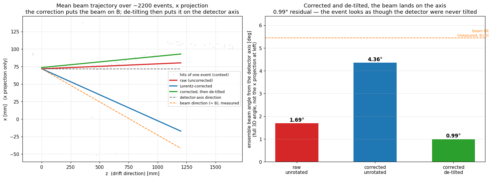
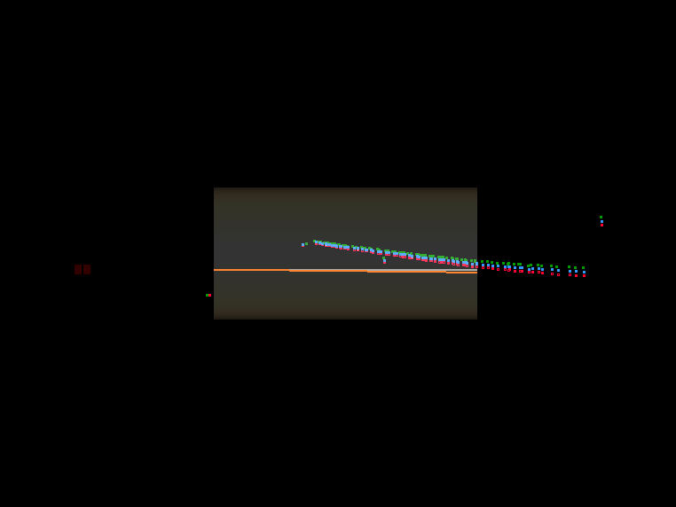
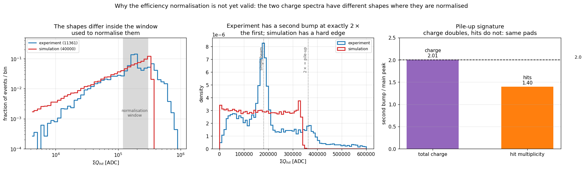

# AT-TPC December 2014 α runs — analysis and simulation manual

Everything needed to reproduce the α+α analysis from raw `.graw` files to an excitation
function, and to run the simulation that validates the reconstruction.

Branch: **`FairRootv18.00-fairroot19-port`**, worktree
`/home/yassid/fair_install/ATTPCROOTv2_fr19port`.

> **Work on this branch only.** `AtEvent` is `ClassDef(3)` here and `ClassDef(6)` on
> `OpenKF-Claude`. Opening a file written by the other branch yields **zero hits with no
> error message at all** — not a warning, not an exception, just empty events. If every
> event looks empty, check which branch wrote the file before debugging anything else.
> This cost a full day once.

---

## 1. Setup

### 1.1 Environment

```bash
cd /home/yassid/fair_install/ATTPCROOTv2_fr19port
source setup_fr19port.sh
```

This sets `VMCWORKDIR`, `SIMPATH`, the ROOT/FairRoot paths, **and the Geant4 data
variables** (`G4ENSDFSTATEDATA`, `G4LEVELGAMMADATA`, …). Those last ones are set *nowhere*
in `build/config.sh`; without them every simulation dies with
`G4ENSDFSTATEDATA environment variable must be set` before the first event.

### 1.2 Build

```bash
cd build && cmake .. && make -j8
```

The event display is built PCL-free: `AtEventDisplay` is no longer gated behind
`PCL_FOUND`, and the RANSAC/Hough drawing paths were removed from `AtEventDrawTask`. You
do **not** need PCL to visualise events.

### 1.3 Building with GENFIT

GENFIT is **already wired into this branch** — `AtGenfit`, `AtSpacePointMeasurement` and
`AtFitterTask` are compiled into `libAtReconstruction` whenever CMake finds GENFIT2, and
CATIMA is built here too (`AtTools/AtELossCATIMA`). No source port is needed. What was
missing was purely the configure line: the default `build/` was made without GENFIT2, and a
naive reconfigure fails on HDF5 rather than on GENFIT.

Use a **separate build tree**, so the working PCL-free build is not disturbed:

```bash
mkdir -p build_genfit && cd build_genfit
cmake -DGENFIT=/home/yassid/fair_install/GenFitInst \
      -DHDF5_DIR=/home/yassid/fair_install/hdf5-1.10.4-inst/share/cmake/hdf5 ..
make -j10
```

Verify rather than assume — the classes are inside `libAtReconstruction`, so there is no
`libAtFitter` to look for:

```bash
ldd lib/libAtReconstruction.so | grep genfit     # -> libgenfit2.so.2.2
root -l -b -q -e 'gSystem->Load("libgenfit2"); gSystem->Load("libAtReconstruction");
                  printf("%p\n",(void*)TClass::GetClass("AtFITTER::AtGenfit"));'
```

Both `AtFITTER::AtGenfit` and `genfit::Track` resolve at runtime, with 138 genfit symbols
exported.

> `-DHDF5_DIR` is not optional. Without it the configure dies with
> `Could NOT find HDF5 (missing: HDF5_LIBRARIES HDF5_INCLUDE_DIRS)` — which looks like an
> unrelated failure and hides the fact that GENFIT itself is found perfectly well.

### 1.4 Python

The analysis scripts need `numpy`, `scipy`, `matplotlib` and **`sklearn` ≥ 1.3** (for
`sklearn.cluster.HDBSCAN`, which is part of scikit-learn — *not* the standalone `hdbscan`
package, which is not installed and is not needed).

The system `python3` (3.8) has numpy and matplotlib but **no scipy and no sklearn**. Use:

```bash
PY=/home/yassid/attpc_spyral/.venv/bin/python     # sklearn 1.5.0, numpy 1.26.4, scipy 1.13.1
```

Any Python ≥3.9 environment with those four packages works; nothing here is Spyral-specific.

### 1.5 Directory layout

| Path | Contents |
|---|---|
| `/media/yassid/Cris_OneD/Dec2014_alphas/run_XXXX/` | raw `CoBo*.graw` (read-only source) |
| `~/dec2014_links/run_XXXX/` | symlink trees (scratch, regenerable) |
| `$VMCWORKDIR/runfiles/NSCL/Dec2014_alphas/` | run lists — **not tracked in git**, regenerate |
| `~/dec2014_alphas_reco/lowP/` | unpacked hits, runs 128–139 (3.1 GB) |
| `~/dec2014_calib/` | analysis scratch: CSVs, pickles, plots |
| `macro/Unpack_GETDecoder2/calib/` | all analysis scripts (tracked) |

The scripts read and write intermediate products in `~/dec2014_calib`. Create it and run
from there. Script *imports* are self-locating, but several data paths are still hardcoded
to that directory — grep for `dec2014_calib` if you relocate.

---

## 2. Detector parameters and where they came from

`parameters/ATTPC.alpha_150torr.par`. The values that were **measured in this analysis**
rather than inherited:

| Parameter | Value | Provenance |
|---|---|---|
| `DriftVelocity` | 2.25 cm/µs | 2.251 ± 0.011 (run 100, B=0) and 2.253 (run 128) from the 90° opening angle |
| `TiltAng` | 6.47° | run 100 with the magnet **off**, where the beam direction measures the tilt directly |
| `TBEntrance` | 320 | beam's closest approach to the detector axis (misses by 2.2 mm). **Was 280** — an error of 40 tb = 144 mm in *z* |
| `EField` | 12000 V/m | from the beam geometry. The cathode (15 kV / 1 m) implies 15000; the beam axis-crossing strongly prefers 12000. The ~20 % gap is within GARFIELD-level accuracy and is accepted |
| `BField` | 0.5691 T | run log |
| `ThetaPad` | 110.9° | pad-plane rotation; a fit of the Lorentz shear gives 112 |
| `ThetaRot` | −161.9° | azimuth of **B** in the pad plane, from the run-100 beam |
| `SamplingRate` | 6.0 | → `GetTBTime()` = **160 ns** per time bucket |

Two gotchas in this file:

- **`TB0` (98) is marked DEPRECATED and must not be used as the drift-time origin.** See §3.4.
- **`Gain: 0.28` is not a gain.** It is harmless when unpacking data (unused) but makes
  simulated ADC ~20000× too small. The simulation therefore uses a separate file.

### Parameter sets

| File | Use |
|---|---|
| `ATTPC.alpha_150torr.par` | experimental data, 149–150 torr (runs 128–139) |
| `ATTPC.alpha_150torr_sim.par` | **simulation only** — `Gain: 5000`, `CoefL/CoefT: 0.0009` |
| `ATTPC.alpha_300torr_noB.par` | magnet-off calibration runs 96–113, 299.5 torr |

The diffusion coefficients differ because the experimental file says `0.025` labelled
`[cm^-0.5]` while `AtClusterizeTask` consumes the number as `[cm²/µs]`. The label is wrong,
not the code; the simulation file carries a value in the units actually used.

---

## 3. The Lorentz / Langevin correction

This is the heart of the reconstruction. Read this section before changing anything.

### 3.1 Why it is needed

The detector is tilted by ~6.5° so that the beam does not run down the pad-plane normal.
That means **E** and **B** are *not parallel*. Ionisation electrons therefore do not drift
straight down **E**: the **E**×**B** term pushes them sideways, and a track is reconstructed
sheared away from its true direction. The shear grows linearly with drift time, so hits far
from the pad plane are displaced most.

### 3.2 The equation

From the AT-TPC commissioning paper (Bradt *et al.*, NIM A **875** (2017) 65, eq. 4):

```
v_D = v/(1+ωτ²) · [ Ê + ωτ (Ê × B̂) + ωτ² (Ê·B̂) B̂ ]        with  ωτ = (B/E)·v
```

Two departures from the published form, both necessary here:

1. **The paper assumes B lies in the y–z plane** (tilt azimuth = 90°). For the Dec 2014
   data the beam — and hence **B** — sits at about **−162°** in the pad plane. The azimuth
   is therefore kept general and read from `ThetaRot`. Passing `azimDeg = 90` reproduces
   the published expression exactly.

2. **The result must be rotated into the pad frame by `ThetaPad`.** The Langevin solution
   is derived in the *field* frame, but it is applied to *pad* coordinates. Omitting this
   rotation was the original bug: the shear came out with roughly the right magnitude
   pointing about 110° away from where it belonged, which looks like a plausible-but-wrong
   correction rather than an obvious failure.

### 3.3 Where it lives

`AtParameter/AtLangevin.h` — header-only, `AtTools::LangevinDrift(...)`. **One** definition,
used by both directions of the calculation:

| Direction | Caller | Action |
|---|---|---|
| forward (simulation) | `AtClusterizeTask` | displaces electrons by **+v_xy · t** |
| reverse (reconstruction) | `AtPSA::CalculateXCorr/YCorr` | subtracts the same |

These were once two independent copies. That is dangerous, not merely untidy: the
simulation's entire claim to validating the correction is that truth and reconstruction
disagree by nothing. If the copies drift apart, the residual silently measures the
difference *between the copies* instead of testing the physics. Keep the single helper.

### 3.4 The drift-time origin

The transverse and longitudinal corrections must agree about where *z* = 0 is:

```cpp
Double_t AtPSA::DriftTimeUs(Int_t tb) const {
   Double_t tbZero = fEntTB - fZk * 100.0 / (fTBTime * fDriftVelocity);
   return (tb - tbZero) * fTBTime * 1E-3;
}
```

`CalculateZGeo` puts *z* = 0 at that `tbZero`; `fTB0` (98) is **not** that value, which is
why it is deprecated. With the calibrated parameters `tbZero = 42.22`.

Note the origin only **translates** the event — it cannot rotate it. It moves the vertex,
never a track direction. An earlier hypothesis that `TB0` caused the over-rotation was
disproved numerically: the beam tilt is identical to four decimal places for `TB0` from
−100 to +200.

Sign matters: drift time is `T = tb − tbZero`, **not** `tbZero − tb`. The inverted form
goes negative for beam hits (tb up to 289) and produced a bogus v_D of 4.05.

### 3.5 Numbers for the calibrated parameter set

With v = 2.25 cm/µs, B = 0.5691 T, E = 12000 V/m, tilt 6.47°, azimuth −161.9°, `ThetaPad`
110.9°:

```
ωτ         = 1.0671
v_D        = (0.18272, −0.02463, 2.23479) cm/µs      [pad frame]
|v_xy|     = 0.1844 cm/µs
shear      = atan(|v_xy| / v_z) = 4.716°
full drift = 44.75 µs  →  82.5 mm transverse displacement
```

The reconstruction logs exactly these numbers once per run:

```
==== Lorentz drift vector (pad frame) : (0.182718, -0.024625, 2.23479) cm/us,  omega*tau = 1.06706
```

### 3.6 How it was validated

**Against Monte-Carlo truth**, commit `8f9d645e`. Simulated α+α events go
truth → Langevin drift → digitisation → *the same PSA the experimental data uses*, so the
residual is measured against a truth no experiment can supply.

| drift [mm] | N tracks | uncorrected | corrected |
|---|---|---|---|
| 85 | 56 | 3.65° | 1.89° |
| 255 | 620 | 3.55° | 1.64° |
| 425 | 480 | 3.47° | 1.47° |
| 595 | 1137 | 3.84° | 1.29° |
| 765 | 1716 | 4.61° | 0.68° |
| 935 | 1737 | **4.73°** | **0.16°** |

(5000 events; an earlier 1000-event run gave 4.73 / 0.22 at full drift.)

What makes this convincing is the *quantitative* prediction: a transverse v_xy alongside a
drift v_z tilts an apparent track by exactly `atan(v_xy/v_z) = 4.716°`, so the uncorrected
error must converge to that at full drift. It measures 4.73° — 0.3 %. The correction then
removes it to 0.22°.

Improvement shrinks at short drift (2.0× at 255 mm vs 21.5× at 935 mm) simply because there
is less shear to remove. That is proportionality to drift time, not a weakness.

> **Use track DIRECTION, not hit-to-point distance, to test a position correction.** A hit
> sits at a pad centre, so for an oblique track the true point can be most of a pad away
> however perfect the correction is. That granularity floor made the hit-distance test look
> like a failure at middle drift (residuals of 60–90 mm against a shear of only 26–36 mm).
> Direction averages the granularity down over many hits and is the observable the physics
> rests on anyway.

> **Fix the pass criterion before looking at the numbers.** Here: the uncorrected error had
> to *grow* with drift, and the corrected error had to be small. Stating that in advance is
> what made the result trustworthy — two earlier rounds got the *z* convention backwards and
> then misread the outcome as a code bug (see `71df2f1f`, which retracts a drift-length
> "bug" that never existed). If the advance prediction fails, the setup is wrong; do not
> reinterpret the numbers.

### 3.7 Re-checking the correction on real data

The correction actually written into the production files can be verified in closed form —
dump the hits (§4.4) and compare `PositionCorr − Position` against the prediction:

```python
tbZero = 320 - 1000*100/(160*2.25)          # = 42.22
t      = (tb - tbZero) * 160e-3             # µs
dx_pred, dy_pred = -0.182718*t*10, -0.024625*t*10   # mm
```

On run 128 this closes to **max |applied − predicted| = 0.0011 mm over 19 465 hits**.

### 3.8 Known limitation

`ThetaPad` and `ThetaRot` are **not individually identified** — only their net effect is
constrained by the data. Changing `ThetaPad` alone silently breaks the correction.

**Partially resolved** by the beam-axis test in §5.4.8: measured against the B = 0 beam,
`ThetaRot` behaves as a **pad-frame** azimuth (1.56° away) rather than a field-frame one
rotated by `ThetaPad` (10.43° away). `AtLangevin.h` documents it as pad-frame but rotates by
`ThetaPad` anyway, and `ThetaPad` — itself fitted to the shear — absorbs the difference. The
net correction is therefore right while the two angles are individually mis-assigned. **Do
not "fix" one without refitting the other.** A clean separation still needs the pad-map
geometry.

---

## 4. Experimental chain

### 4.1 Build the symlink trees and run lists

`AtGRAWUnpacker` maps files to decoders with a `%i` pattern, so the inputs need contiguous
`file<N>_` indices. It also matters that chunk 0 comes first: plain `ls` sorts `".1.graw"`
*before* `".graw"`, which desynchronises the per-CoBo event counters and **silently kills
PSA** — you get a file with no hits and no error.

```bash
cd $VMCWORKDIR
for r in $(seq -w 128 139); do bash macro/Unpack_GETDecoder2/calib/make_links.sh run_0$r; done
```

Prints `<runfile path> <number of CoBos>`; expect **9** CoBos for these runs. The list is
written to `$VMCWORKDIR/runfiles/NSCL/Dec2014_alphas/alpha_run_XXXX.txt`, which is where the
unpack drivers look. Override `ATTPC_RAW` / `ATTPC_LINKS` if your paths differ.

> Run lists are **not tracked in git** — always regenerate them. They contain absolute
> paths to the symlink trees.

### 4.2 Unpack

```bash
bash macro/Unpack_GETDecoder2/calib/unpack_lowP.sh ATTPC.alpha_150torr.par 128 129 130
```

The driver counts events first with `count_events.C`, then unpacks. **The event count must
be exact**: asking for more events than the run holds crashes at end-of-data (`rc=129`) and
*truncates the output*.

Output: `~/dec2014_alphas_reco/lowP/alpha_run_XXXX_hits.root`, ~20 MB per 1000 events.
`AtRawEvent` is not persisted (~30 kB/event instead of ~1.3 MB); you get hits only.

Expect **9216 pads/event**. If you see 2304, you are hitting the AsAd-merge bug — that is
fixed on this branch and validated digit-for-digit against the 2014 reference analysis.

Runs 128–139 are already produced (3.1 GB, ~15 min/run, all `rc=0`):

| run | events | run | events |
|---|---|---|---|
| 128 | 11361 | 134 | 13103 |
| 129 | 11880 | 135 | 12776 |
| 130 | 15778 | 136 | 10594 |
| 131 | 15734 | 137 | 14337 |
| 132 | 12915 | 138 | 14674 |
| 133 | 10523 | 139 | 10115 |

### 4.3 Look at events

```bash
bash macro/Unpack_GETDecoder2/calib/open_eve_fr19.sh ~/dec2014_alphas_reco/lowP/alpha_run_0128_hits.root
```

Needs a display. `run_eve_Dec2014_alphas.C` is the underlying macro.

### 4.4 Dump hits to CSV

The python analysis reads CSV, not ROOT:

```bash
cd $VMCWORKDIR/macro/Unpack_GETDecoder2        # so ./rootlogon.C is picked up
root -l -b -q 'dump_hits.C("'$HOME'/dec2014_alphas_reco/lowP/alpha_run_0128_hits.root","'$HOME'/dec2014_calib/prod_128.csv","hits",-1)'
```

Columns: `event,pad,tb,x,y,z,xc,yc,zc,q,qtot` where `x,y,z` are raw pad coordinates,
`xc,yc,zc` the Lorentz-corrected ones, and:

- **`q` = `GetCharge()`** — pulse *peak height*
- **`qtot` = `GetQHit()`** — pulse *integral*

Use `qtot` for anything involving deposited energy or total charge. Mode `"qtot"` writes one
summed `GetQHit()` per event, which is what the trigger study consumes.

### 4.5 Cluster the tracks

Plain HDBSCAN on (x, y, z) merges the two outgoing arms **at the vertex** — exactly where you
least want it to, because the vertex is a real density maximum. `cluster_tracks.py` therefore
clusters in a *direction-aware* space: position augmented by the sign-invariant orientation
tensor **d**⊗**d** of each hit's local neighbourhood. Two arms crossing at a vertex have
different orientations even where they touch, so they separate.

```bash
$PY macro/Unpack_GETDecoder2/calib/batch_scan.py     # clusters run 128, writes candidates.pkl
```

Clustering runs **once per event** at a reference drift velocity, and the assignment is then
reused while v_D is scanned — otherwise HDBSCAN would run 11k times per scan point.

> **Watch for isolated noise hits.** One stray hit (`tb=224, x=−51.5, q=22`) gave a 22 mm
> arm a fake 142 mm extent and moved the fitted v_D from 2.8 to 4.6. Cluster-size and
> extent cuts are not cosmetic here.

### 4.6 Calibrate

```bash
$PY macro/Unpack_GETDecoder2/calib/calibrate_run.py all_run0100.csv --B 0.0 --E 30000 --tilt 7.0
$PY macro/Unpack_GETDecoder2/calib/fit_params.py
```

The method: for equal-mass non-relativistic elastic scattering the two outgoing α's always
separate by **90°**. The pad coordinates are fixed by geometry, but the *z* coordinate scales
with v_D — so v_D is the value that puts the opening-angle peak at 90°.

Restrictions that matter:

- The 90° constraint holds **only for elastic scattering off He**. Scattering off the C and
  O in the CO₂ populates smaller opening angles, so fit the *peak position*, never the mean.
- **Use a magnet-off run (96–113) to measure the tilt.** With B on, the solenoid steers the
  beam, so the beam direction describes the beam, not the detector. For the same reason the
  axis-crossing check is only meaningful with B off.
- **Regress x and y *on* drift time**, and average slope *components* before forming an
  angle. A 3D total-least-squares line fit inflates the angle (6.89° vs 6.40°) because pads
  are 8×12 mm while time is finely sampled; and taking a median of per-event angles inflates
  it again (6.96° vs 6.42°) because `hypot()` is positive-definite and noise cannot cancel.

### 4.7 Verify the production

```bash
$PY macro/Unpack_GETDecoder2/calib/verify_production.py
$PY macro/Unpack_GETDecoder2/calib/plot_production.py
```

Checks `GetPositionCorr()` per run: beam polar angle, opening-angle peak, vertex position.

### 4.8 Excitation function

The beam enters at 7.8 MeV and slows continuously, so **the vertex position *is* an energy
measurement** — a single run scans E_cm from 3.9 MeV down to 0. That is the whole point of
thick-target inverse kinematics.

Energy loss comes from CATIMA (ported from OpenKF-Claude) for **He:CO₂ 90–10** at 150 torr,
tabulated in `calib/eloss_alpha_heco2.txt`.

```bash
$PY macro/Unpack_GETDecoder2/calib/excitation.py
$PY macro/Unpack_GETDecoder2/calib/kinematics.py     # acceptance-independent closure test
```

`kinematics.py` is the consistency check worth understanding: acceptance changes how densely
events populate a kinematic locus, but **it does not move the locus**. So E₁ = E cos²θ₁ and
θ₁+θ₂ = 90° can be tested even though the efficiency is unknown.

> The elastic selection is not optional. Omitting it leaves a sample dominated by split
> tracks and θ₁+θ₂ comes out at 27° instead of 90°.

---

## 5. Simulation chain

`macro/Simulation/ATTPC/Dec2014_alphas/`.

### 5.1 Geometry and gas

- Medium `heco2_150` in `geometry/media.geo` — He:CO₂ 90/10, 7.27e-5 g/cm³
- `geometry/ATTPC_HeCO2_150torr.C` generates `ATTPC_HeCO2_150torr.root`

> The geometry generator **hangs in `CheckOverlaps` after writing its files** — just kill it.

### 5.2 Generate

```bash
cd $VMCWORKDIR/macro/Simulation/ATTPC/Dec2014_alphas
root -l -b -q 'He4He4_sim_el.C(4000)'
```

α+α elastic, beam 4He at 1.95 MeV/u (p_z = 0.241296 GeV/c per nucleon), field 5.691 kG.
~23 s for 4000 events.

> `AtTPC2Body` via `AtVertexPropagator` **alternates beam-only and reaction events**, so a
> 4000-event run gives 2000 reactions. Outgoing energies well under half the beam energy are
> also expected, not a bug: vertices are spread along a beam that has already slowed, so a
> late vertex gives products of only tens of keV.

#### Running in parallel

For the statistics the trigger study needs, use the driver rather than a loop:

```bash
bash bulk_sim.sh 8 5000 ~/dec2014_sim_bulk     # 8 streams x 5000 = 40000 events
```

It generates, digitises and dumps the per-event charge in one pass, then concatenates the
streams into `qtot_sim_bulk.txt`. Two reasons it cannot be a simple `for` loop in one
directory:

- **Both macros write `./data/attpcsim_in.root` by name.** Streams sharing a working
  directory overwrite each other's files mid-run. Each stream gets its own directory.
- **The default seed comes from `time(NULL)`**, which has one-second granularity — streams
  launched together would draw *byte-identical* events and the extra CPU would buy no extra
  statistics at all. `He4He4_sim_el.C` now takes an explicit seed as its third argument
  (`0` keeps the old time-seeded behaviour), and the driver gives each stream a distinct
  one. The seed is echoed as `==== Generator seed : N`, so a run can be reproduced.

> **Do not put `set -u` in a script that sources `setup_fr19port.sh`.** That script, and
> FairSoft's `thisroot.sh` underneath it, reference unset variables as a matter of course,
> so `set -u` kills the shell *at the source line* — before anything is echoed. The symptom
> is a script that produces no output whatsoever and creates none of its directories.

### 5.3 Digitise

```bash
root -l -b -q 'rundigi_sim.C("./data/attpcsim_in.root","./data/digi.root",kFALSE)'
```

`clusterize → pulse → AtPSASimple2` — **the same PSA the experimental data goes through**,
with the same threshold (20). That identity is what makes the comparison meaningful.

The third argument is `keepElectrons`. Leave it `kFALSE`: persisting the drifted electrons
costs ~6 MB **per event**. With it off, 4000 events digitise in ~7 min into 82 MB.

Uses `ATTPC.alpha_150torr_sim.par` (see §2).

### 5.4 Validating the Lorentz reconstruction — the full recipe

This is the single most important check in the analysis, so it is written out end to end.
Everything needed is here; §3 gives the physics behind it.

#### 5.4.0 Why it needs the simulation at all

**The data has no truth.** Nothing in an experimental file says where the ionisation
*really* was, so no experimental quantity can tell you whether a position correction
recovered it. The simulation supplies that truth: events go

```
Geant4 truth  ->  Langevin drift (AtClusterizeTask)  ->  digitisation  ->  AtPSASimple2
```

and the last step is **the same PSA the real data goes through**, with the same threshold.
The correction is applied on the way out, and the question is whether it returns what went
in.

This only means something because the forward drift and the reverse correction call **one**
shared helper, `AtTools::LangevinDrift` (§3.3). If they were separate copies, the residual
would measure the difference *between the copies* and would look perfect no matter how
wrong the physics was. **If you ever split them, this test stops being a test.**

#### 5.4.1 Generate and digitise

Any sample of a few thousand events is enough; 5000 gives ~1700 tracks in the deepest
drift bin.

```bash
cd $VMCWORKDIR/macro/Simulation/ATTPC/Dec2014_alphas
root -l -b -q 'He4He4_sim_el.C(5000)'
root -l -b -q 'rundigi_sim.C("./data/attpcsim_in.root","./data/digi.root",kFALSE)'
```

`keepElectrons` may stay `kFALSE` — the drifted-electron collection is not used here, and
it costs ~6 MB per event. The MC linkage is automatic: `AtPSAtask` picks up the
`AtTpcPoint` branch from the IO manager and hands it to the PSA, so there is no flag to
set.

#### 5.4.2 Run the comparison

```bash
root -l -b -q 'resdir.C("data/digi.root","data/attpcsim_in.root")'
```

**Both files are required, and they must be the same run.** The truth points live in the
Geant4 output, the reconstructed hits in the digitised one, and the macro matches them
**entry by entry** — pair up two different runs and you are comparing unrelated events. It
warns if the entry counts differ.

#### 5.4.3 Fix the pass criterion *before* looking

Write this down first. It is the difference between a measurement and a rationalisation:

- the **uncorrected** direction error must **grow** with drift distance, because the shear
  is proportional to drift time;
- the **corrected** error must be small, and must shrink as drift grows.

If the uncorrected error does not grow, the setup is wrong — **discard the run and find the
bug; do not reinterpret the numbers.** Two earlier attempts got the *z* convention
backwards, and the second was written up as a code bug in `AtClusterizeTask` that did not
exist (retracted in `71df2f1f`).

#### 5.4.4 Read the output

```
RES  drift[mm]    Ntrk    uncorr[deg] corrected[deg]
RES         85      56           3.65           1.89
RES        255     620           3.55           1.64
RES        425     480           3.47           1.47
RES        595    1137           3.84           1.29
RES        765    1716           4.61           0.68
RES        935    1737           4.73           0.16
```

Both halves of the criterion are met. But the check that makes it *convincing* is
quantitative, not just "the residual is small":

> A transverse drift `v_xy` alongside a longitudinal `v_z` tilts an apparent track by
> exactly `atan(v_xy/v_z)`. For the calibrated parameters that is
> **atan(0.1844/2.2348) = 4.716°** (§3.5), so the uncorrected error is *required* to
> converge to that value at full drift.

It measures **4.73°** — agreement to 0.3 %. The correction then removes it to **0.16°**.
That number is predicted from the parameter file alone, with nothing fitted, which is why
it is worth more than the size of the residual.

The corrected error being larger at short drift (1.89° at 85 mm vs 0.16° at 935 mm) is
**not** a weakness: there is simply less shear to remove there, so the fixed
pad-granularity noise dominates.

#### 5.4.5 Use directions, never hit-to-point distances

A hit sits at a **pad centre**. For an oblique track the true ionisation point can be most
of a pad away however perfect the correction is, so hit-to-point distance has a floor set
by geometry rather than by the drift model. That floor made an earlier version of this test
look like a *failure* at middle drift — residuals of 60–90 mm against a shear of only
26–36 mm present there. It was granularity, not a defect.

Fitting a direction over many hits averages the granularity down, and direction is the
observable every physics result here rests on anyway.

`res.C`, `res2.C`, `res3.C` are the earlier position-residual versions, kept only for
reference. `res4.C` tests whether the middle-drift residual came from labelling a hit by
`MCSimPoint[0]` when several MC points share a pad. It did not: `<points/hit> = 1.0`, so
the weighted centroid equals `MCSimPoint[0]` exactly, and that hypothesis is refuted.

#### 5.4.6 A cross-check on real data, with no simulation

The above validates the *physics*. To check that the code applied the arithmetic you think
it did — on the actual production files — dump the hits (§4.4) and compare
`PositionCorr − Position` against the closed form:

```python
tbZero = 320 - 1000*100/(160*2.25)                   # = 42.22
t      = (tb - tbZero) * 160e-3                      # us
dx_pred, dy_pred = -0.182718*t*10, -0.024625*t*10    # mm
```

On run 128 this closes to **max |applied − predicted| = 0.0011 mm over 19 465 hits**.

The two checks answer different questions and you want both: this one says the code does
what the formula says, §5.4.4 says the formula is right.

#### 5.4.7 If it fails

In order of how often each has actually been the cause:

1. **Every event empty** — the file was written by the other branch (`AtEvent` ClassDef 3
   vs 6). Silent; check this first.
2. **The uncorrected error is flat in drift** — the forward drift is not being applied.
   Confirm `AtClusterizeTask` logs a non-zero `v_xy`, and that `BField` and `EField` are
   non-zero in the *simulation* parameter file.
3. **Both errors are large** — check `ThetaPad`/`ThetaRot` (§3.8). They are degenerate, so
   changing one alone silently breaks the correction.
4. **The corrected error exceeds the uncorrected one** — a sign convention; the forward and
   reverse steps are adding rather than cancelling.

#### 5.4.8 An independent test on real data: rotate the event onto the beam axis

Everything above uses the simulation, which feeds events through **the same Langevin helper
going in as coming out**. That can only show the code inverts its own forward model — an
error shared by both directions cancels invisibly. This test uses **no simulation**.

**The idea** (Yassid's): **B** is parallel to the beam and the detector is tilted, so the
beam sits at `TiltAng` from the pad-plane normal. If the correction is right, rotating a
*corrected* event by that tilt lands the beam on the detector axis — the event looks as
though the detector had never been tilted. If the correction is wrong, a residual tilt
survives the rotation.

```bash
# dump 3000 events of a magnet-OFF run and a magnet-ON run
root -l -b -q 'dump_hits.C(".../alpha_run_0100_hits.root","hits_run100.csv","hits",3000)'
root -l -b -q 'dump_hits.C(".../alpha_run_0128_hits.root","hits_run128.csv","hits",3000)'
$PY calib/rotate_to_beam.py hits_run100.csv hits_run128.csv
```

Result on 3000 events of each:

| quantity | value |
|---|---|
| beam axis measured at B=0 (run 100, raw) | 5.44° off the detector axis |
| run 128 **uncorrected** | 5.89° from that axis |
| run 128 **corrected** | **1.22°** — 4.8× better |
| **shear removed by the correction** | **4.69°** vs **4.72° predicted** |

The last row is the result: the magnitude is predicted from `BField`, `EField` and
`DriftVelocity` alone — nothing fitted to this observable — and confirmed on data to
**0.6 %**. The residual 1.22° is consistent with the reference axis itself being uncertain
by ~1.5°, so it bounds the correction's error rather than measuring a defect.



*Left: mean beam trajectory over ~2200 events of run 128 (x projection). The Lorentz
correction (blue) brings the beam onto the measured **B** direction (orange); rotating by
the tilt then brings it onto the detector axis (green). Mean trajectories rather than one
event, because the per-event direction scatters by ~5° from beam divergence and fit noise.
Right: the same as full 3D angles — corrected and de-tilted, the beam sits 0.99° from the
detector axis.*



*The event display (`run_eve_Dec2014_alphas.C`): red raw hits, blue Lorentz-corrected, green
the same hits rotated onto the detector axis; orange the beam direction, grey the detector
axis. The three sets differ by a few degrees and overlap at this zoom — the display is for
inspecting single events interactively, not for reading angles off.*

> **Use the empirical reference, not the parameter file.** At B = 0 there is no shear, so
> the raw run-100 beam direction *is* the beam axis, and no angle convention can be got
> wrong. Building the reference from `TiltAng`/`ThetaRot`/`ThetaPad` instead gave an axis
> 10.4° away and made the correction look as though it made things **worse** (5.0° → 9.2°).
> That was entirely an artefact of the reference, and it is the trap to avoid here.

**This partially breaks the `ThetaPad`/`ThetaRot` degeneracy of §3.8.** Comparing both
readings of `ThetaRot` against the measured beam axis:

| interpretation | distance from the measured axis |
|---|---|
| field-frame azimuth, then rotated by `ThetaPad` | 10.43° |
| **pad-frame azimuth, no extra rotation** | **1.56°** |

So `ThetaRot` behaves as a pad-frame azimuth. `AtLangevin.h` documents it that way but then
rotates the result by `ThetaPad` as well; `ThetaPad` (110.9, itself fitted to the shear)
absorbs the difference, which is why the net correction comes out right even though the two
angles are individually mis-assigned. **Do not "fix" one without refitting the other.**

> **A stale file was found doing this.** `alpha_run_0100_hits.root` had been unpacked on
> 7 Aug, before the pad-frame fix `4bfcdb5f` landed on 11 Aug, so its stored
> `PositionCorr` came from the old buggy correction — and it was not inert at B = 0, which
> it must be. `GetPosition` is untouched by that code, so the raw column stayed valid. The
> file has been regenerated. **When a corrected position looks wrong, check the file's date
> against the last change to `AtPSA`/`AtPSASimple2` before suspecting the physics.**

Caveat: run 100 is 300 torr and run 128 is 150 torr. The tilt is mechanical and the beam
line common, so the axis should not move, but that has not been demonstrated independently.

#### 5.4.9 `TBEntrance` confirmed, and the sharpest test of the correction

`verify_production.py` reports the beam crossing the detector axis at 1157 ± 6 mm where the
origin puts it at 1000 — an apparent 157 mm systematic. Since the vertex position *is* the
beam energy in thick-target kinematics, that would have biased the whole excitation
function, so it was worth chasing.

**It was a method artefact.** That estimate, and a second one giving 846 mm, both
extrapolated a closest-approach point *per event* from a short lever arm: a small slope
error moves the crossing a long way, and the per-event distribution has an IQR of ~400 mm.
A median of fragile numbers is still fragile.

Fitting each event's beam line and then averaging the **line parameters** — evaluating the
closest approach once, at the end — gives (`find_tbentrance.py`):

| run | | `TBEntrance` | miss distance |
|---|---|---|---|
| 100 | magnet **off** | **320 ± 4** | 12.5 mm |
| 128 | corrected | **319 ± 10** | 16.3 mm |
| 128 | *uncorrected* — control | 100 ± 25 | 81 mm |

**`TBEntrance` = 320 is correct as it stands**, confirmed to ±4 tb (±15 mm) on a run where
B = 0 and no drift correction has to be trusted. The energy scale of the excitation function
is not biased.

The control row is also the **sharpest demonstration of the drift correction so far**:
without it, the beam's closest approach lands 220 tb (~790 mm) from where the magnet-off run
puts it and misses the axis by 81 mm. With it, 319 ± 10 against 320 ± 4 — agreement to one
time bucket, with nothing tuned to achieve it.

> **Do not average positions in bins of drift time and fit that.** It looks more robust than
> per-event fitting and is badly biased: at a given tb the events do not all contain the
> same track, so the mean is diluted toward the pad-plane centre and the slope shrinks. That
> version returned a beam polar angle of **3.72°** where every other method gives ~6.4°, and
> an implied shift of +580 mm. Regression dilution — average the fit *parameters*, never the
> data being fitted.

Caveat: the polar angle from this particular estimator also runs low (6.10° on run 100)
because a median over events including some contaminated fits shrinks the slope. Quote
angles from the clustered fit in `verify_production.py` instead. The closest-approach
comparison between runs is unaffected, since the same shrinkage applies to all three rows.

### 5.5 Trigger efficiency

The simulation has **no trigger**, so comparing total charge per event between simulation and
data isolates exactly that: where the data is deficient relative to simulation, the trigger
was firing inefficiently.

```bash
root -l -b -q 'dump_hits.C(".../digi.root","'$HOME'/dec2014_calib/qtot_sim.txt","qtot",-1)'
root -l -b -q 'dump_hits.C(".../alpha_run_0128_hits.root","'$HOME'/dec2014_calib/qtot_exp_128.txt","qtot",-1)'
$PY macro/Unpack_GETDecoder2/calib/trigger_eff.py
```

Result (4000 simulated events vs all 11361 of run 128):

| ΣQ [ADC] | exp / sim |
|---|---|
| 7.1e3 | 0.16 |
| 1.2e4 | 0.38 |
| 2.4e4 | 0.54 |
| 3.9e4 | 0.80 |
| 6.2e4 | 0.99 |

Two things fell out that were not put in: the **absolute charge scale agrees to ~7 %** in the
median even though the simulated gain is an untuned guess; and above 4e5 ADC the data shows a
tail the simulation cannot produce — **beam pile-up**, since the generator makes one reaction
at a time.

Normalisation is taken on the bulk (1.2–3.0e5), *not* on total area, precisely so the pile-up
tail cannot distort the low-charge comparison.



*Why the trigger normalisation is not valid. Left: the two spectra have different shapes
inside the shaded normalisation window. Centre: the experiment peaks at 1.8e5 with a second
bump at exactly twice that; the simulation is flat to a hard kinematic edge. Right: the
pile-up signature — 2.01x the charge but only 1.40x the hits.*

> **This is not a usable efficiency curve, and more statistics will not make it one.**
> See below.

#### Why the normalisation is not valid (40 000-event test)

The 4000-event version left it open whether the sub-unity plateau and the scatter above
1e5 were statistical. Ten times the statistics settled it: **they are systematic.** The
ratio in the normalisation window reproduces to two decimals — 1.91 / 1.05 / 0.48 at 40k
against 1.99 / 1.04 / 0.48 at 4k — instead of averaging out. Noise would have shrunk by
√10.

The cause is that the two spectra have **different shapes in the very window used to
normalise them** (`charge_shapes.py`, `plots/charge_shapes.png`):

- **experiment** — sharply peaked at 1.8e5, with a second bump near 3.6e5
- **simulation** — nearly flat, rising to a hard edge at ~3.3e5, then nothing

The second experimental bump is **beam pile-up**, and the evidence is quantitative: its
charge is **2.01×** the main peak while its hit count is only **1.40×**. A second beam
particle doubles the deposited charge but lands on largely the *same* pads, since both
follow the beam axis. 7.1 % of experimental events sit above 4e5 ADC against 0.005 % of
simulated ones.

The shape difference itself has a likely cause worth checking before any repair:
`AtVertexPropagator` forces a reaction at a **uniformly distributed vertex**, so the charge
deposited before it is uniform too — hence a flat spectrum. Real triggered events are
dominated by beam crossing the full length without reacting, which deposits a *fixed*
charge — hence a sharp peak. If so, the simulated sample composition is an artefact of the
generator rather than a prediction, and no normalisation window can be correct.

What survives: the **shape** of the low-charge turn-on, which is stable between 4k and 40k
(0.16, 0.22, 0.35, 0.37, 0.40, 0.54, 0.74, 0.85 from 7.1e3 to 3.9e4). Its **absolute
scale** is undetermined.

> **A correction to the earlier claim.** The 4000-event run was reported as showing the
> absolute charge scale agreeing to ~7 %. That was a comparison of *medians of two
> differently shaped distributions* and is much weaker than it sounded. The defensible
> statement is the charge **per hit**, which cancels track-length differences: sim/exp =
> **1.13**. So the micromegas gain is roughly right; the event-level spectra are not.

---

## 6. Traps

Ordered by how much time each one cost.

1. **Cross-branch `AtEvent` ClassDef 3 vs 6 → silently zero hits.** No error of any kind.
2. **A ROOT macro's entry function must match its filename.** Copying a macro and renaming
   the file makes ROOT fall back to `.L` and do *nothing*. Bit us three separate times.
3. **Libraries must be loaded from `rootlogon.C`, not `#include`d.** Loading from inside a
   macro function is too late — cling parses the whole function first and every class comes
   out as "unknown type name". `AtTpcPoint` (MC truth) lives in **`libAtTpc`**; omitting it
   makes the macro fail to parse and produce *no output at all*, which reads like an empty
   loop rather than an error. `libAtSimulationData` does not exist on this branch.
4. **Geant4 data paths are set nowhere in `build/config.sh`** — always source
   `setup_fr19port.sh`.
5. **`ls` orders `.1.graw` before `.graw`**, desynchronising CoBo event counters and killing
   PSA silently. `make_links.sh` handles it; do not hand-roll the list.
6. **Overrunning the event count crashes and truncates** the output file.
7. **`cd ... && nohup ... &` backgrounds the whole compound**, so the `cd` happens in a
   subshell and the job launches from the wrong directory.
8. **`pgrep`/`pkill` patterns match the matcher's own command line.** Bracket them
   (`unpackReco_C15[d]`) and verify with `ps` before believing — or killing — anything.
9. **`FairRunAna::SetInputFile` is gone in FairRoot 18.6** — use
   `SetSource(new FairFileSource(...))`.
10. **`CalcLorentzVector` runs per event, not once.** An unguarded `cout` there fired
    599 923 times in 1000 events. It is now behind a `static bool`.

---

## 7. Open issues

- **Energy reconstruction** is not done. The range route is broken by the `arc_length`
  estimator; the curvature route `p = 0.3qBR` is preferred and the validated simulation can
  now check it against truth momenta.
- **Trigger efficiency** is blocked on a *systematic*, not on statistics (§5.5). The
  40 000-event test showed the two charge spectra have different shapes in the
  normalisation window. Next step: check whether the simulated vertex distribution is the
  cause, by comparing a non-reacting beam-only sample against the data's main peak.
- **Pile-up** is absent from the simulation, so the high-charge region cannot be compared.
- **`ThetaPad`/`ThetaRot` degeneracy** — partially resolved (§3.8, §5.4.8): `ThetaRot` is a
  pad-frame azimuth, and `ThetaPad` absorbs the mis-assignment. A clean separation still
  needs the pad-map geometry.
- **Bradt thesis eq. 3.14** (detector → beam frame, left-handed) not implemented.
- **Angular distributions per reaction energy** vs published data — blocked on acceptance.
- **GENFIT port** deferred; its precision cannot yet be exploited.

---

## 8. Script reference

`macro/Unpack_GETDecoder2/calib/`

| Script | Purpose |
|---|---|
| `make_links.sh` | symlink trees + run lists (§4.1) |
| `unpack_lowP.sh` | bulk unpack, 149–150 torr runs |
| `unpack_noB.sh` | magnet-off calibration runs 96–113 |
| `unpack_one.sh` / `unpack_all_fr19.sh` | single / bulk unpack |
| `open_eve_fr19.sh` | event display (this branch) |
| `cluster_tracks.py` | direction-aware HDBSCAN (§4.5) |
| `batch_scan.py` | cluster a whole run, collect elastic candidates |
| `fit_params.py` | fit v_D (and ωτ, tilt) from the opening angle |
| `calibrate_run.py` | full calibration chain for one run |
| `opening_angle.py` | v_D from the 90° constraint |
| `langevin.py` | Langevin drift for arbitrary tilt azimuth (python mirror of `AtLangevin.h`) |
| `verify_production.py` | per-run checks on `GetPositionCorr()` |
| `plot_production.py`, `plot_opening.py` | production plots |
| `excitation.py` | excitation function via CATIMA energy loss |
| `kinematics.py` | acceptance-independent closure test |
| `trigger_eff.py` | trigger turn-on from charge spectra (takes exp/sim/out paths) |
| `charge_shapes.py` | why the normalisation is not valid; the pile-up signature (§5.5) |
| `rotate_to_beam.py` | validates the correction on **real data** (§5.4.8) |
| `find_tbentrance.py` | confirms the longitudinal origin (§5.4.9) |
| `view_event.py`, `analyse_event.py`, `vertex_tangent.py`, `validate130.py` | single-event tools |
| `eloss_alpha_heco2.txt` | CATIMA α energy loss, He:CO₂ 90-10 @ 150 torr |

`macro/Unpack_GETDecoder2/`

| Macro | Purpose |
|---|---|
| `run_unpack_Dec2014_alphas.C` | decode + PSA |
| `count_events.C` | exact event count (required, §4.2) |
| `dump_hits.C` | hits → CSV, charge → txt (§4.4) |
| `run_eve_Dec2014_alphas.C` | event display |

`macro/Simulation/ATTPC/Dec2014_alphas/`

| Macro | Purpose |
|---|---|
| `He4He4_sim_el.C` | α+α elastic generator + Geant4 (3rd arg = RNG seed) |
| `bulk_sim.sh` | N parallel generate→digitise→dump streams |
| `rundigi_sim.C` | clusterize → pulse → PSA |
| `resdir.C` | **direction** validation of the correction vs MC truth (§3.6, §5.4) |
| `res.C`, `res2.C`, `res3.C`, `res4.C` | earlier position-residual versions, kept for reference |

Plots live in `~/dec2014_calib/plots/`.
